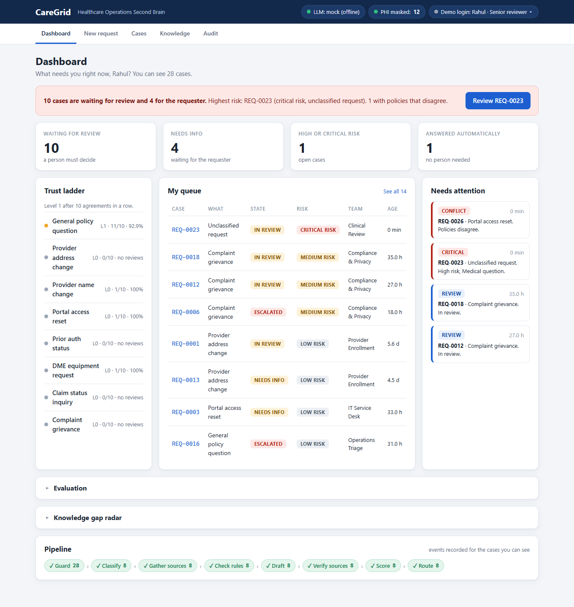
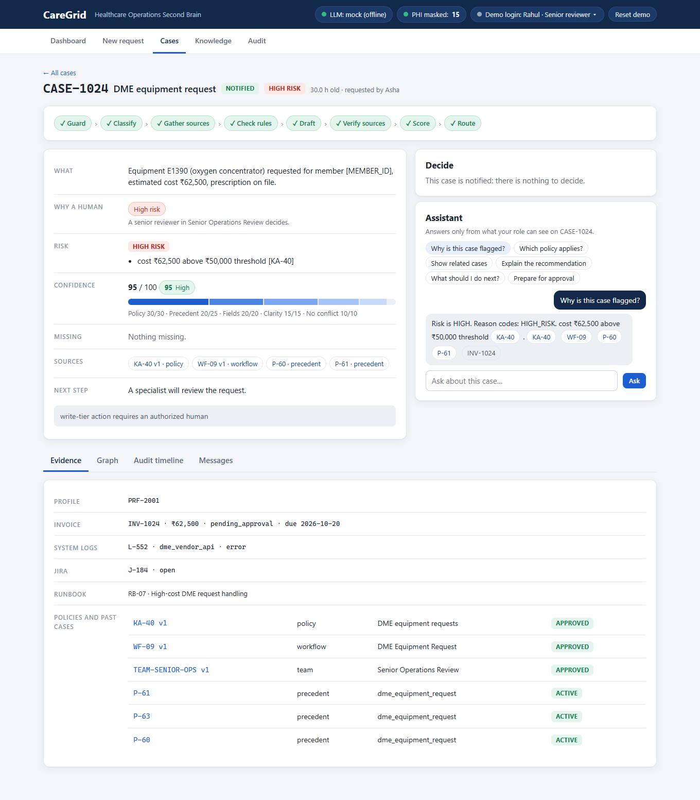
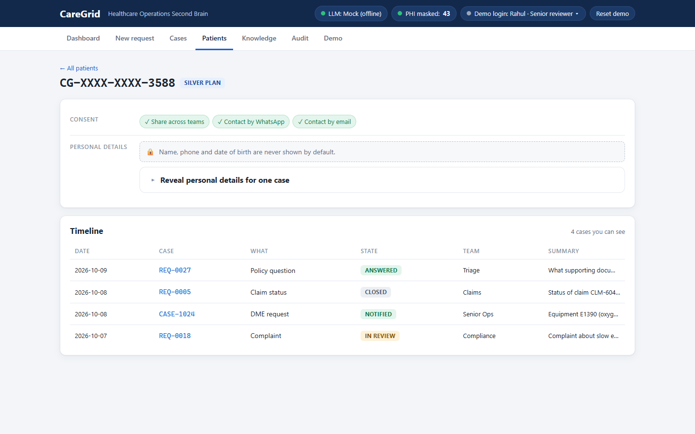
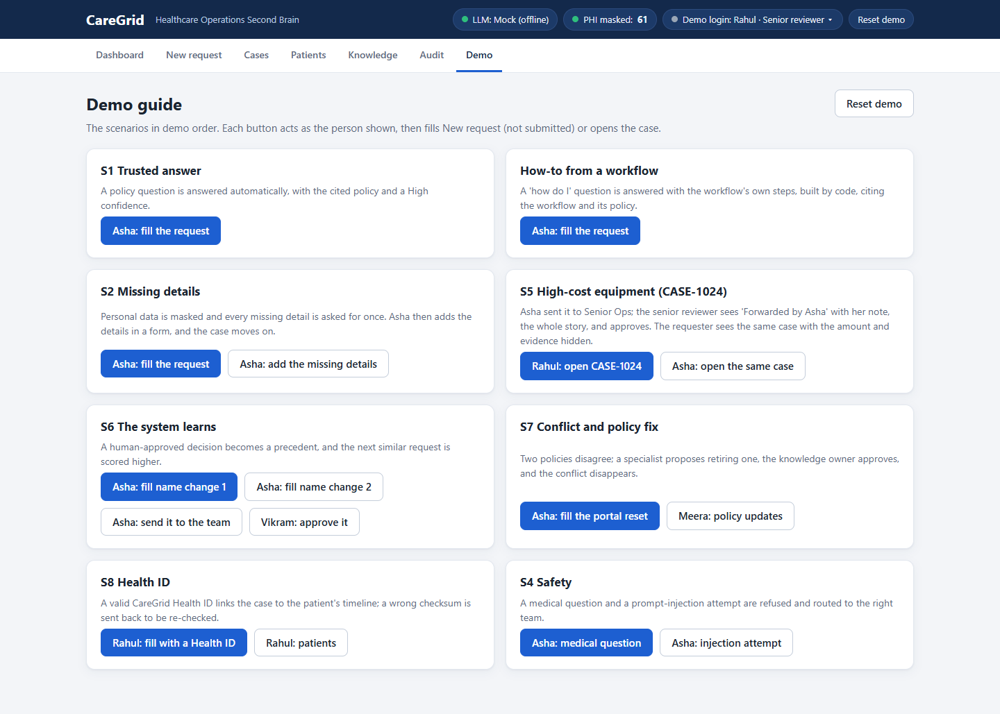

# CareGrid — The Healthcare Operations Second Brain

**AI prepares the decision. Humans own the decision.**

### Live demo: https://caregrid-ie5f.onrender.com

Free tier: the first load can take about 50 seconds while the service wakes up. All data is synthetic. Open the **Demo** page and use the **Demo login** switcher (top right) to act as different roles.

## The problem

- Operations staff search scattered, sometimes contradicting policies for every question.
- Requests bounce back and forth, one missing detail at a time.
- Cases get routed to the wrong team and ping-pong before anyone decides.

## What CareGrid does

- **Cited, versioned answers**: every answer names the policy page and version it rests on, or abstains.
- **Asks for all missing details at once**, in one numbered message; the requester fills a form and the case moves on.
- **Right team first time**, with a requester-confirmed handoff ("Send to Senior Operations Review?") before a reviewer sees it.
- **Safety routing**: medical questions, personal-data requests and complaints are never automated; they go to a person at once.
- **Amazon SNS email alerts** for critical cases, blocked attempts, high-risk approvals and slow reviews (no personal data in the message; simulated when no topic is configured).
- **Learns from every human-approved decision**: approvals become precedents, rejections never do.

## How it works

`Guard → Classify → Retrieve → Rules → Propose → Check sources → Score → Route`

**Code decides every routing, number and citation; the LLM only writes the wording.**

## Key features

- **Second Brain**: versioned markdown pages, stale-precedent detection, a lint report for conflicts, gaps and expired links.
- **Confidence from 5 measured signals** (policy, similar past cases, required details, request clarity, no conflict) plus a **trust ladder** per request type.
- **Guardrails**: PII masked before anything is stored or sent to a model, cite-or-abstain, role-based access before retrieval, prompt-injection defence.
- **Patient Health ID**: Verhoeff checksum, consent flags, role-filtered timeline, audited reveal with a mandatory reason.
- **"Why this decision"**: each claim linked to the page, version, section and file behind it.
- **Policy updates approved like pull requests**: a reviewer suggests, the knowledge owner approves, dependent precedents go stale.

## Screenshots

| Dashboard | Case story page |
|---|---|
|  |  |
| **Patient record** | **Demo guide** |
|  |  |

## Try it in 2 minutes

Open the **Demo** page; every card has "Act as …" buttons that switch the login and fill the request (not submitted) or open the case.

| Card | Act as | What you will see |
|---|---|---|
| S1 Trusted answer | Asha (ops employee) | A policy question answered automatically with its cited policy |
| How-to | Asha | The workflow's own steps, built by code, citing the workflow and its policy |
| S2 Missing details | Asha | Personal data masked, every missing detail asked once; "Add missing details" form moves the case on |
| S5 High-cost equipment (CASE-1024) | Rahul (senior reviewer), then Asha | "Forwarded by Asha", the whole story, approve with email and WhatsApp (simulated); Asha sees the amount hidden |
| S6 The system learns | Asha, then Vikram | A name change is approved; the next similar request scores higher |
| S7 Conflict and policy fix | Asha, Kiran, Meera (knowledge owner) | Two policies disagree; one is retired through an approved policy update; the conflict disappears |
| S8 Health ID | Rahul | A valid ID links the case to the patient timeline; a wrong checksum is sent back |
| S4 Safety | Asha | A medical question and a prompt-injection attempt are refused and routed |

## Proof

- **Automated tests: 1,422 passing** (`pytest`, mock LLM, no network), including real-browser tests of every demo scenario.
- **Regression eval** (`eval/scorecard.json`, 66 synthetic requests, mock LLM): request type 66/66, routing 66/66, safety 23/23, citation validity 177/177.
- **Blind held-out eval** (`eval/heldout.csv`, 30 rows written independently and never edited, `eval/scorecard.heldout.*`): as written, mock 28/30 type and 28/30 routing, safety 12/14; after a documented adjudication of 4 rows (`eval/heldout_adjudication.csv`) 30/30 and 14/14. The Gemini run on 8 Oct (before later changes) scored 26/30 type and 27/30 routing as written, 30/30 and 29/30 adjudicated.
- **Leak scan: 0** findings in the Second Brain and the database (`python -m caregrid.cli check`, 10 checks, including a data audit that recomputes every dashboard number from the raw cases).
- **Independent adversarial reviews**: reviewer rounds on the API and on the Health ID feature each came back with findings that were fixed and are covered by tests (commits "api: review hardening", "api: review round 3", "health id: review hardening", "health id: final hardening").

## Architecture

**Today**: Docker · FastAPI + static web UI · SQLite · markdown Second Brain · Gemini behind one LLM interface (offline deterministic fallback when the model is unavailable) · Amazon SNS alerts.

**AWS target** (the code is built local-first behind `Store` and `LLM` interfaces): Lambda · DynamoDB · Step Functions (a human-approval pause) · Amazon Bedrock · S3.

## Run locally

```bash
conda create -n caregrid python=3.11 -y && conda activate caregrid
pip install -r requirements.txt
python -m caregrid.cli reset     # generate synthetic data, compile the Second Brain, seed the demo
python -m caregrid.cli serve     # http://127.0.0.1:8000
python -m pytest -q              # tests (mock LLM)
```

```bash
docker build -t caregrid .
docker run --rm -p 8000:8000 -e APP_ACCESS_CODE=letmein caregrid
```

More: `docs/DEPLOY.md` (Docker, Render), `docs/DEVELOPMENT.md` (commands, contracts, decisions log).

## Honest limits and roadmap

- All data is synthetic; nothing here is a real patient or provider.
- The demo login is not real authentication.
- WhatsApp and SMS messages are simulated; email alerts go through SNS only when a topic is configured.
- Amazon Bedrock access is pending; the Bedrock provider is implemented but not exercised here.
- Roadmap: ABHA/ABDM integration for the Health ID, Microsoft Presidio and Bedrock Guardrails for masking and output checks, the Lambda / DynamoDB / Step Functions deployment.

---

Team Dhurandhar · Acentra Health Hackathon 2026
